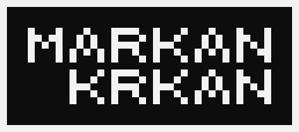

 

---

  

# INTRODUCTION

Hello,

 

markankrkan here✌️

 

Here are all my LeetCode solutions,

I wll try my best to do as many problems as I can and add them to this repo,

currently I am intrested in learning **Go** and **TypeScript** so most likely all of my solutions will be written in those two languages.

 

I am still new to this thing called programming,

so my solutions may not be fully time and memory efficient,

but I wll try to do my best.

 

Made with ❤️

---

  

# SOLUTIONS

- [Go](./go/go.md)
- [TypeScript](./typescript/typescript.md)

---