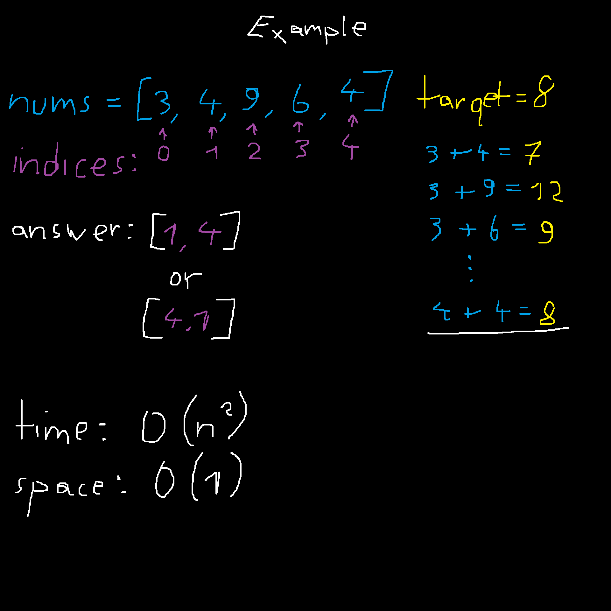
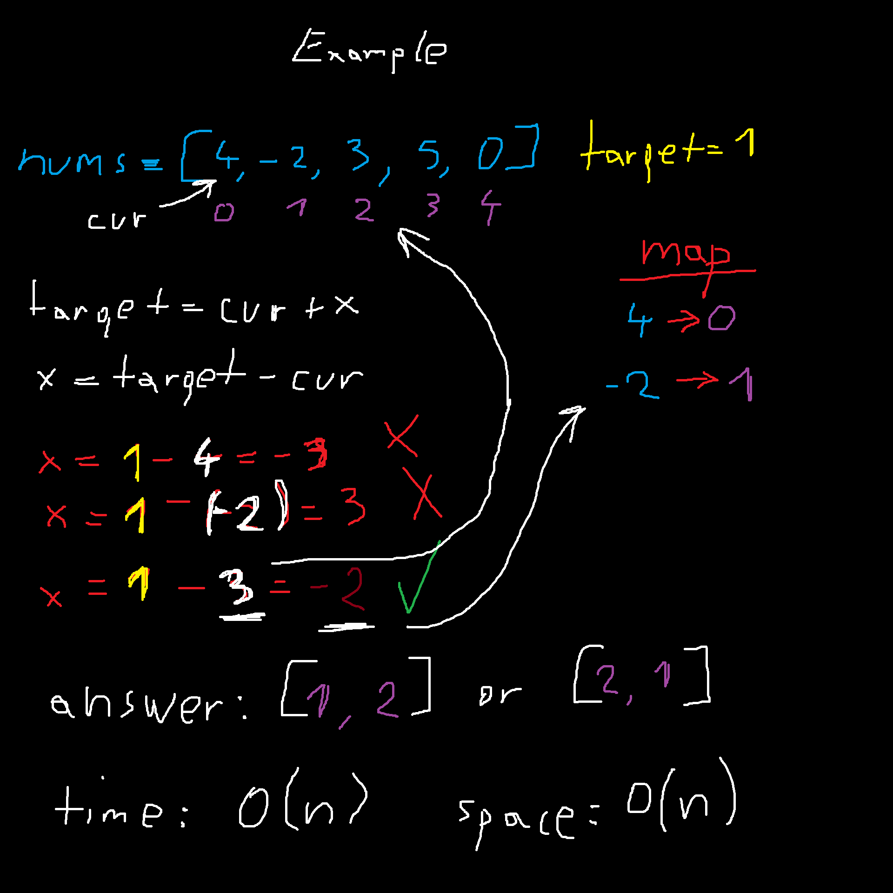

## 1. Two Sum

Given an array of integers **nums** and an integer **target**, return indices of the two numbers such that they add up to **target**.

You may assume that each input would have exactly one solution, and you may not use the same element twice.

You can return the answer in any order.

<br>

> Example 1:

`Input: nums = [2,7,11,15], target = 9`

`Output: [0,1]`

`Explanation: Because nums[0] + nums[1] == 9, we return [0, 1].`

<br>

> Example 2:

`Input: nums = [3,2,4], target = 6`

`Output: [1,2]`

<br>

> Example 3:

`Input: nums = [3,3], target = 6`

`Output: [0,1]`

<br>

Constraints:

- 2 <= nums.length <= 10⁴

- -10⁹ <= nums[i] <= 10⁹

- -10⁹ <= target <= 10⁹

- **Only one valid answer exists.**

<br>

Follow-up: Can you come up with an algorithm that is less than **O(n²)** time complexity?

---


<br><br>


## EXPLANATION ON HOW TO SOLVE PROBLEM

One of ways is to check every number combination (**brute checking**) which would give us **O(n²)** time and **O(1)** space complexity.



Second way is to create **map** and in that map we will store number we need and indices where that number is located which would give us **O(n)** time and **O(n)** space complexity, but in-detail about second way little bit later

Lot of times (or just what I saw) when we have **O(n²)** time and **O(1)** space complexity we can improve it to **O(n)** time and **O(n)** space complexity.

<br>

First way is more space efficient, second way is more time efficient.

If I am right we in general care more about time rather than space, why?

Because we can always make more space in memory, but we can not buy more time.

<br>

### Second way in more detail

We will have some array of intigers and integer target,

instead of brute checking every single combination we can use map and that will allow us to remember which number we already saw.

<br>

Algorithm should something like this:

- we have formula `target = cur + x` and formula `x = target - cur` (**cur = number we are currently looking**, **x = mysterious number**)
- e.g. target is `1` and array looks like this: `nums = [4, -2, 3, 5, 0]`
- we are looking at number `4` (**cur**) in formula `x = 1 - 4 = -3`, and we will store `4` in map with indices `0` in case I need that information
- we repeat same process for number `-2`, `x = 1 - (-2) = 3`, we look at the map and search for `3`, we don't see it so we store `-2` with indice `1` in the map
- then we move to `3`, `x = 1 - 3 = -2`, we look at the map and search for `-2`, and we can see it is there
- then we just return `result = [1, 2]` or `result = [2, 1]`, we can stop here because only one solution is guaranteed



---


<br><br>


## SOLUTION

```typescript
function twoSum(nums: number[], target: number): number[] {

    // Create an empty Map.
    // Key = number from the array
    // Value = index where that number was found
    const seen = new Map<number, number>();

    // Loop through every element in nums
    for (let i = 0; i < nums.length; i++) {

        // Current number
        const num = nums[i];

        // Calculate the number we need
        const needed = target - num;

        // Check if we've already seen the needed number
        if (seen.has(needed)) {
            return [seen.get(needed)!, i];  // Return the previous index and the current index
        }

        // Store the current number and its index
        seen.set(num, i);
    
    }

    return [];

};
```

---